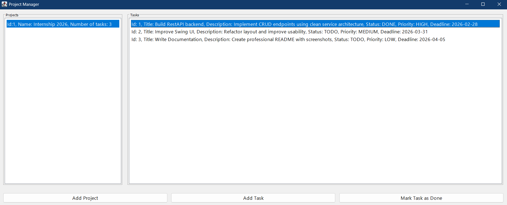

# Java Task Manger (Desktop Application)


A Java Swing desktop application for managing projects and tasks with clean OOP architecture.

## Application Preview



---

## Overview

The application allows users to create projects and assign multiple tasks to each project.

Each task has:

- A status (TODO, IN_PROGRESS, DONE)
- A priority (LOW, MEDIUM, HIGH)

---

## Technologies

- Java 25 (LTS)
- Java Swing (JFrame, JPanel, JTable)
- OOP (Encapsulation, Enums, Separation of Concerns)
- ArrayList for in-memory data management

---

## Project Structure

The application is organized into logical packages:

```text
java-task-manager/
│
├── src/
│   ├── app/
│   │   └── App.java
│   │
│   ├── model/
│   │   ├── Priority.java
│   │   ├── Project.java
│   │   ├── Status.java
│   │   └── Task.java
│   │
│   ├── service/
│   │   ├── ProjectService.java
│   │   └── TaskService.java
│   │
│   └── ui/
│       └── MainWindow.java
│
├── images/
│   └── main-window-filled.png
│
├── .gitignore
└── README.md
```

The project follows a layered architecture separating domain models, business logic, and the user interface.

The `images/` folder contains documentation screenshots used in this README.

---

## Architecture Highlights

- Clear separation between UI, Service, and Model layers
- Enum-based status and priority management
- Service layer handles business logic independently from UI
- Designed to be easily extendable with database integration

---

## Features

- Create and manage projects
- Add tasks to projects
- Assign status and priority
- Mark tasks as done
- Filter and sort tasks
- Simple desktop interface

---

## Limitations

- No database integration (data is stored in memory)
- No user authentication
- No data persistence after application restart

---

## Future Improvements

- Integrate relational database (e.g. MySQL)
- Implement persistent storage layer
- Add user authentication system
- Improve UI responsiveness

---

## How to Run

1. Clone the repository
2. Open the project in IntelliJ IDEA or any Java IDE
3. Run the `App` class
4. The application window will start

---

## Author

Mahdi Vejdani – Umschüler zum Fachinformatiker für Anwendungsentwicklung
